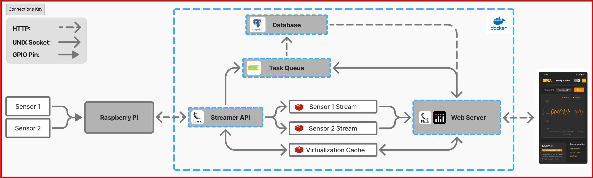
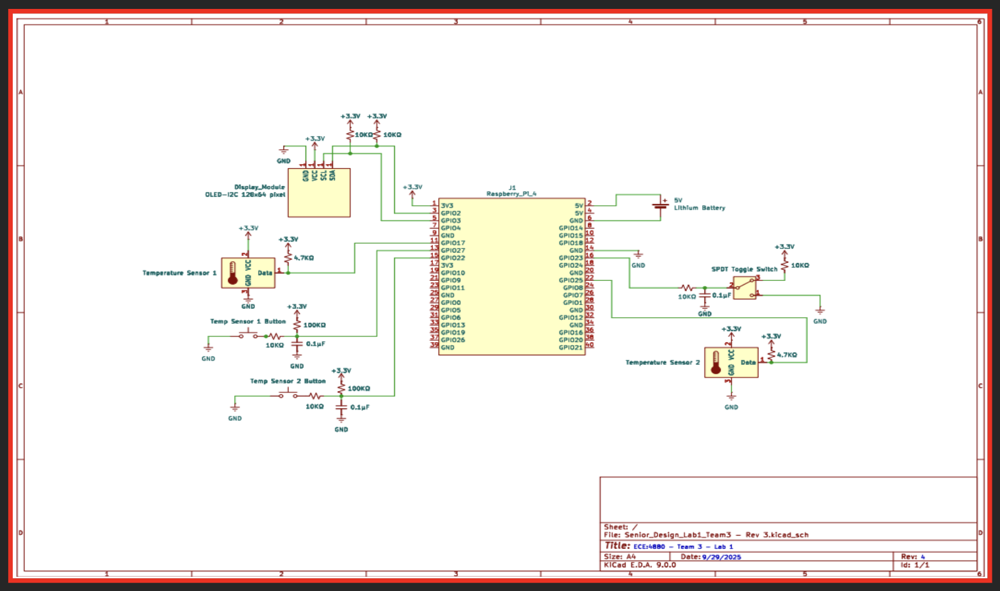
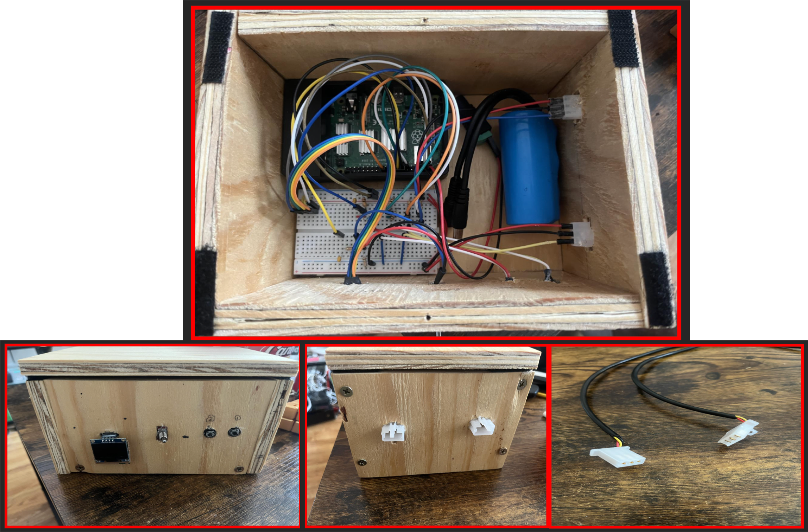
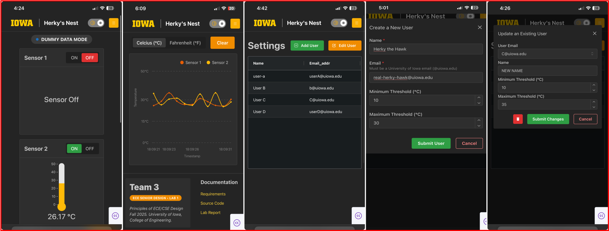
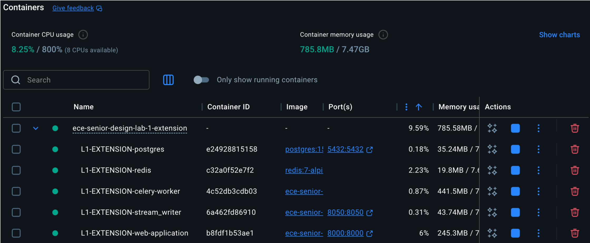

# ECE-Senior-Design-Lab-1 (Extension Application)

To move past a prototype and build a more robust system, this application was created with support for further iterations of the project in mind. Having already completed the base requirements, this application was purely experimental and aimed at how our protoype could be improved.

The biggest change with between this extension application and the [original application](https://github.com/Senior-Design-2025-2026/L1-web-application) is the architecture. This system utilizes four components: a dedicated entry point for streaming data into a UNIX Socket provided Redis Stream, a PostgreSQL database to store temperature readings and user information, and an asynchronous processor with a pool of workers to handle blocking processes with high overhead in the background, and an improved dashboard UI designed for mobile devices. Additionally, all components were containerized using Docker for ease of scalability and deployment.  

With this performant and extensible foundation, any smart-home application is straightforward and highly configurable; Adding an additional sensor (thermometer, humidity, air quality, etc) just means adding new endpoints to handle sensor information within the Streamer API service, creating a new stream, and creating a new table within the database. The additional sensor information can then be used for analytics and real-time operations in response to external sensor readings.  

## System Architecture
<div align="center">
  
  <div><em>Figure 1. System Architecture</em></div>
</div>

## Raspberry Pi Pin-Out Diagram
<div align="center">
  
  <div><em>Figure 2. Raspberry Pi Pin-Out Diagram</em></div>
</div>

## Finished Product
<div align="center">
  
  <div><em>Embedded System</em></div>
  <br>
</div>

<div align="center">
  
  <div><em>Embedded System + Web Application</em></div>
</div>

## Source Code
**Embedded System:**  
  - [L1-EXTENSION-embedded-thermostat](https://github.com/Senior-Design-2025-2026/L1-EXTENSION-embedded-thermostat)

**Software Application:**
  - Web Application  
    - [L1-EXTENSION-web-application](https://github.com/Senior-Design-2025-2026/L1-EXTENSION-web-application)  
  - Streamer API  
    - [l1-EXTENSION-stream-writer](https://github.com/Senior-Design-2025-2026/L1-EXTENSION-stream-writer)  
  - Asynchronous Task Queue  
    - [L1-EXTENSION-celery-worker](https://github.com/Senior-Design-2025-2026/L1-EXTENSION-celery-worker)  
  - Sqlalchemy ORM  
    - [L1-EXTENSION-postgres-orm](https://github.com/Senior-Design-2025-2026/L1-EXTENSION-postgres-orm)

# Running the Project
We cannot share our physical box, but we can share all you need to run the project in a dummy environment :)

## Prerequisites
This repository contains submodules which must be initialized.

After pulling this repository, run the following command:
```
git submodule update --recursive --init
```

You must also have Docker installed on your computer to spin up the application locally. Please read the [Docker documentation](https://docs.docker.com/) on how to get started.

<div align="center">
  
  <div><em>Running Project</em></div>
</div>

## Starting Docker Containers:
After initializing the submodules and downloading Docker, simply run the command:
```
docker compose up
```

## Viewing the Dashboard
Running the container will expose port 8000 which your mobile device can connect to. 

Within your mobile browser, enter the path:
```
<IP>:8000
```

To find your devices IP, use the following command:

MacOS: $ ipconfig getifaddr en0

Linux: $ ip addr show

Windows: $ ipconfig
